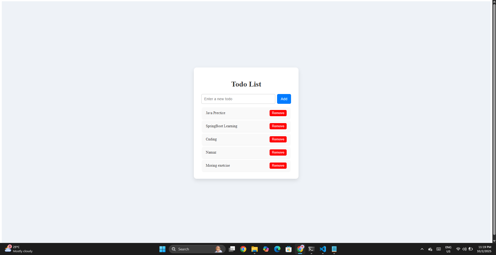

<!-- 🖼️ Project Banner -->
<p align="center">
  
</p>

<h1 align="center" style="color:#007bff;">🌟 Todo App - React + Vite 🌟</h1>

<p align="center">
  <strong>Minimal, fast, responsive & lightweight Todo App</strong>
</p>

---

## 🛠️ Technologies Used

<p align="center">
  
  
  
  
  
</p>

---

## 🔮 Features & Planned Tech Stack

- ✅ Lightweight React + Vite frontend
- ✅ Todo list CRUD (Add / Remove / List)
- ✅ Fully responsive design (Mobile + Desktop)
- 🎨 Clean & modern UI
- 💾 Future integration:
  <p align="center">
 <p align="center">
   <strong>Java</strong> &nbsp;
   <strong>Spring</strong> &nbsp;
   <strong>Spring Boot</strong> &nbsp;
   <strong>MySQL</strong>
</p>


---

## 💻 Project Structure


<p>
  todo-app/
  
├─ src/

├─ public/

├─ images/

├─ package.json

├─ vite.config.js

├─ README.md
</p>


---

📧 Contact / Socials
<p>
  ⚡ Note for Sharing
If you clone this repository and share it on LinkedIn or any other social media, please mention my GitHub username ibadBargir along with the repository link.
</p>
<p align="center"> 🔗 GitHub:
 <a href="https://github.com/ibadBargir/">

ibadBargir</a> &nbsp;|&nbsp; ✉ Email:
<a href="mailto:ibad72086@gmail.com">
 ibad72086@gmail.com</a>
</p>


## 🚀 How to Run

```bash
# Clone repository
git clone https://github.com/ibadBargir/Todo-App.git

# Go to project folder
cd todo-app

# Install dependencies
pnpm install   # or npm install

# Start development server
pnpm dev       # or npm run dev

